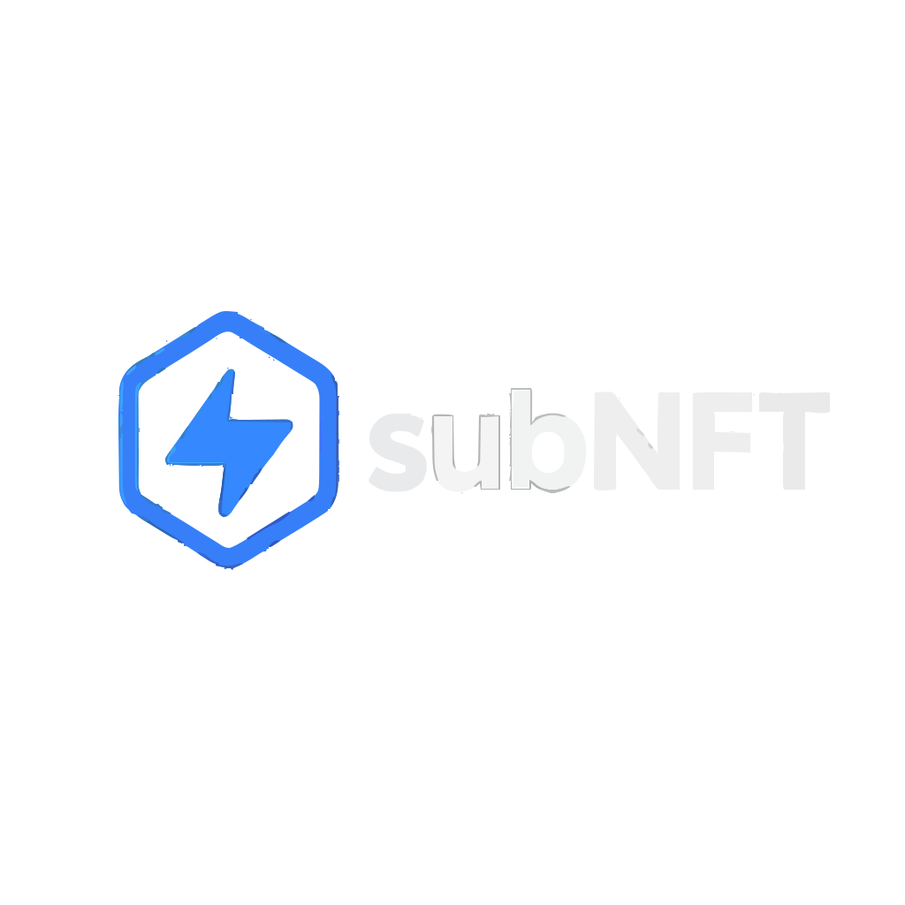

<div align="center">
  
  
  # NFT Sub SDK
  
  TypeScript SDK for NFT Sub - The Web3 Subscription Platform. Built with Reactive Network for automated cross-chain subscription management.
</div>

## Overview

NFT Sub SDK provides a complete toolkit for implementing Web3 subscription services on blockchain. It enables merchants to create subscription plans, accept recurring payments, and issue NFT-based subscription tokens that serve as access passes.

Built on top of the [nftSub Smart Contracts](../nftSub-contracts/), this SDK provides a seamless integration layer for developers to implement subscription functionality in their applications.

## Features

- **ERC-1155 Based Subscriptions**: Each subscription is an NFT that can be transferred or traded
- **Multiple Payment Tokens**: Support for ETH and ERC-20 tokens
- **Automated Renewals**: Reactive Network integration for automatic subscription management
- **Merchant Management**: Complete merchant registration and revenue management
- **Analytics**: Built-in analytics for tracking subscriptions and revenue
- **Event Monitoring**: Real-time event tracking for all subscription activities
- **TypeScript First**: Full type safety and IntelliSense support

## Installation

```bash
npm install @nft-sub/sdk
# or
pnpm add @nft-sub/sdk
# or
yarn add @nft-sub/sdk
```

## Quick Start

### Basic Setup

The SDK supports multiple initialization methods depending on your use case:

#### Frontend (Browser with Wallet)

```typescript
import { SubscriptionSDK } from '@nft-sub/sdk';
import { createWalletClient, custom } from 'viem';

// Using browser wallet (MetaMask, WalletConnect, etc.)
const walletClient = createWalletClient({
  transport: custom(window.ethereum)
});

const sdk = new SubscriptionSDK({
  chain: 'sepolia',
  walletClient // Pass the wallet client
});

// The SDK will auto-detect browser wallets if not provided
const sdkAutoDetect = new SubscriptionSDK({
  chain: 'sepolia'
  // Will automatically use window.ethereum if available
});
```

#### Backend (Server with Private Key)

```typescript
import { SubscriptionSDK } from '@nft-sub/sdk';

// Initialize with private key for automated operations
const sdk = new SubscriptionSDK({
  chain: 'sepolia',
  privateKey: process.env.PRIVATE_KEY
});
```

#### Read-Only Mode

```typescript
// Initialize SDK in read-only mode (no wallet needed)
const sdk = new SubscriptionSDK({
  chain: 'sepolia',
  readOnly: true
});
```

#### Custom RPC & Clients

```typescript
import { createPublicClient, createWalletClient, http } from 'viem';

// Use custom RPC endpoint
const sdk = new SubscriptionSDK({
  chain: 'sepolia',
  rpc: 'https://your-custom-rpc.com'
});

// Or provide your own viem clients
const publicClient = createPublicClient({
  transport: http('https://your-rpc.com')
});

const walletClient = createWalletClient({
  transport: custom(window.ethereum)
});

const sdk = new SubscriptionSDK({
  chain: 'sepolia',
  publicClient,
  walletClient
});
```

### Subscribe to a Merchant

```typescript
// Subscribe with ETH
const txHash = await sdk.subscribe(merchantId, 'ETH');

// Subscribe with ERC-20 token
const tokenAddress = '0x...';
const txHash = await sdk.subscribe(merchantId, tokenAddress);

// Wait for confirmation
await sdk.waitForTransaction(txHash);
```

### Check Subscription Status

```typescript
// Check if user has active subscription
const hasAccess = await sdk.checkAccess(merchantId, userAddress);

// Get detailed subscription status
const status = await sdk.subscriptions.getSubscriptionStatus(
  userAddress,
  merchantId
);
console.log('Expires at:', new Date(Number(status.expiresAt) * 1000));
```

## Merchant Operations

### Register as Merchant

```typescript
const merchantId = await sdk.merchants.registerMerchant({
  name: 'Premium Service',
  description: 'Access to premium features',
  imageUrl: 'https://example.com/logo.png',
  externalUrl: 'https://example.com',
  paymentTokens: [
    {
      address: '0x0000000000000000000000000000000000000000', // ETH
      price: '0.01',
      decimals: 18
    }
  ]
});
```

### Manage Merchant Revenue

```typescript
// Check merchant balance
const balance = await sdk.getMerchantBalance(merchantId, 'ETH');
console.log('Balance:', sdk.formatAmount(balance, 18));

// Withdraw earnings
const txHash = await sdk.withdrawMerchantBalance(merchantId, 'ETH');
```

### Update Subscription Price

```typescript
await sdk.merchants.setMerchantPrice({
  merchantId,
  paymentToken: '0x...', // Token address or zero for ETH
  price: '0.02' // New price in token units
});
```

## NFT Operations

### Check NFT Balance

```typescript
const balance = await sdk.nfts.getBalance(userAddress, merchantId);
console.log('NFT balance:', balance);
```

### Transfer Subscription NFT

```typescript
const txHash = await sdk.nfts.safeTransferFrom({
  from: currentOwner,
  to: newOwner,
  merchantId,
  amount: 1n
});
```

### Get NFT Metadata

```typescript
const metadata = await sdk.nfts.getFullMetadata(userAddress, merchantId);
console.log('Subscription NFT:', metadata);
```

## Event Monitoring

### Monitor Real-time Events

```typescript
sdk.startEventMonitoring({
  onPaymentReceived: (event) => {
    console.log('Payment received:', event);
  },
  onSubscriptionMinted: (event) => {
    console.log('New subscription:', event);
  },
  onSubscriptionRenewed: (event) => {
    console.log('Subscription renewed:', event);
  },
  onMerchantRegistered: (event) => {
    console.log('New merchant:', event);
  }
});

// Stop monitoring when done
sdk.stopEventMonitoring();
```

## Analytics

### Get Platform Statistics

```typescript
const stats = await sdk.analytics.getPlatformStatistics();
console.log('Total merchants:', stats.totalMerchants);
console.log('Total subscriptions:', stats.totalSubscriptions);
console.log('Total volume:', sdk.formatAmount(stats.totalVolume, 18));
```

### Get Merchant Statistics

```typescript
const merchantStats = await sdk.analytics.getMerchantStatistics(merchantId);
console.log('Active subscribers:', merchantStats.activeSubscriptions);
console.log('Total revenue:', sdk.formatAmount(merchantStats.totalRevenue, 18));
```

## Reactive Network Integration

The SDK includes Reactive Network support for automated cross-chain operations.

### Subscribe to Cross-Chain Events

```typescript
// Subscribe to payment events from L1
await sdk.reactive.subscribeToPaymentEvents({
  chainId: 11155111n, // Sepolia
  contractAddress: sdk.getContracts().subscriptionManager
});

// Subscribe to CRON for automatic expiry checks
await sdk.reactive.subscribeToCronJob({
  interval: 3600n // Check every hour
});
```

### Monitor Reactive Events

```typescript
sdk.reactive.watchReactiveEvents({
  onPaymentProcessed: (event) => {
    console.log('Payment processed on L1:', event);
  },
  onSubscriptionExpired: (event) => {
    console.log('Subscription expired:', event);
  }
});
```

## React Components

NFT Sub SDK includes pre-built React components for rapid integration.

### SubscribeButton

A ready-to-use subscription button with built-in wallet connection and payment flow.

```typescript
import { SubscribeButton } from '@nft-sub/sdk/components';

<SubscribeButton
  sdk={sdk}
  merchantId={1n}
  paymentToken="ETH"
  onSuccess={(txHash) => console.log('Subscribed!', txHash)}
  className="custom-class"
/>
```

### SubscriptionCard

Display subscription plans with pricing and status information.

```typescript
import { SubscriptionCard } from '@nft-sub/sdk/components';

<SubscriptionCard
  sdk={sdk}
  merchantId={1n}
  variant="detailed" // 'default' | 'detailed' | 'compact'
  showPricing={true}
  showStatus={true}
  showActions={true}
  onSubscribe={() => console.log('Subscribe clicked')}
  onViewDetails={() => console.log('View details')}
/>
```

### SubscriptionModal

Multi-step subscription modal with payment processing.

```typescript
import { SubscriptionModal } from '@nft-sub/sdk/components';

<SubscriptionModal
  sdk={sdk}
  merchantId={1n}
  isOpen={isModalOpen}
  onClose={() => setIsModalOpen(false)}
  onSuccess={(hash) => console.log('Success!', hash)}
  onError={(error) => console.error(error)}
/>
```

### MerchantDashboard

Complete dashboard for merchants to manage subscriptions and view analytics.

```typescript
import { MerchantDashboard } from '@nft-sub/sdk/components';

<MerchantDashboard
  sdk={sdk}
  merchantId={1n}
  onEditMerchant={() => console.log('Edit')}
  onViewAnalytics={() => console.log('Analytics')}
  onAddSubscription={() => console.log('Add subscription')}
/>
```

### AnalyticsWidget

Display real-time analytics for platform or merchant metrics.

```typescript
import { AnalyticsWidget } from '@nft-sub/sdk/components';

<AnalyticsWidget
  sdk={sdk}
  merchantId={1n} // Optional - omit for platform analytics
  timeRange="30d" // '7d' | '30d' | '90d' | '1y'
  variant="merchant" // 'platform' | 'merchant'
  onTimeRangeChange={(range) => console.log('New range:', range)}
/>
```

### WalletConnect

Wallet connection component with multi-wallet support.

```typescript
import { WalletConnect } from '@nft-sub/sdk/components';

<WalletConnect
  onConnect={(address) => console.log('Connected:', address)}
  onDisconnect={() => console.log('Disconnected')}
/>
```

## React Hooks

The SDK provides comprehensive React hooks for building subscription interfaces.

### useSubscriptionSDK

Initializes and manages the SDK instance in React components.

```typescript
import { useSubscriptionSDK } from '@nft-sub/sdk/hooks';

function App() {
  const { 
    sdk, 
    isInitialized, 
    error, 
    isConnected, 
    address 
  } = useSubscriptionSDK({
    chain: 'sepolia',
    // SDK will auto-detect browser wallet
  });

  if (!isInitialized) return <div>Initializing SDK...</div>;
  if (error) return <div>Error: {error.message}</div>;

  return (
    <div>
      {isConnected ? (
        <p>Connected: {address}</p>
      ) : (
        <button onClick={connectWallet}>Connect Wallet</button>
      )}
    </div>
  );
}
```

### useSubscription

Manages subscription state and operations for a specific merchant.

```typescript
import { useSubscription } from '@nft-sub/sdk/hooks';

function SubscriptionManager({ sdk, merchantId }) {
  const {
    isActive,
    status, // Full subscription status object
    isLoading,
    error,
    subscribe,
    checkStatus // Manually refresh status
  } = useSubscription(sdk, merchantId, userAddress); // userAddress is optional

  const handleSubscribe = async () => {
    const txHash = await subscribe('ETH'); // or token address
    if (txHash) {
      console.log('Subscribed!', txHash);
    }
  };

  if (isLoading) return <LoadingSpinner />;
  
  return (
    <div>
      {isActive ? (
        <div>
          <p>Active until: {new Date(Number(status.expiresAt) * 1000).toLocaleDateString()}</p>
          <p>Renewals: {status.renewalCount.toString()}</p>
          <button onClick={checkStatus}>Refresh Status</button>
        </div>
      ) : (
        <button onClick={handleSubscribe}>Subscribe Now</button>
      )}
    </div>
  );
}
```

### useMerchant

Manages merchant data, balance, and operations.

```typescript
import { useMerchant } from '@nft-sub/sdk/hooks';

function MerchantPanel({ sdk, merchantId }) {
  const {
    merchant, // Merchant plan details
    balance, // Current balance in wei
    isLoading,
    error,
    withdraw,
    setPrice,
    refresh // Manually refresh data
  } = useMerchant(sdk, merchantId);

  const handleWithdraw = async () => {
    const txHash = await withdraw('ETH'); // or token address
    if (txHash) {
      console.log('Withdrawn!', txHash);
    }
  };

  const handleSetPrice = async () => {
    const txHash = await setPrice('ETH', '0.01'); // Token and price
    if (txHash) {
      console.log('Price updated!', txHash);
    }
  };

  return (
    <div>
      <h3>Merchant Dashboard</h3>
      {merchant && (
        <div>
          <p>Payout Address: {merchant.payoutAddress}</p>
          <p>Period: {merchant.subscriptionPeriod.toString()} seconds</p>
          <p>Balance: {sdk.formatAmount(balance, 18)} ETH</p>
          <button onClick={handleWithdraw}>Withdraw</button>
          <button onClick={handleSetPrice}>Update Price</button>
          <button onClick={refresh}>Refresh Data</button>
        </div>
      )}
    </div>
  );
}
```

### useSubscriptionEvents

Monitors blockchain events in real-time with event history tracking.

```typescript
import { useSubscriptionEvents } from '@nft-sub/sdk/hooks';

function EventMonitor({ sdk }) {
  const {
    isMonitoring,
    events, // Array of all captured events with timestamps
    clearEvents
  } = useSubscriptionEvents(sdk, {
    onPaymentReceived: (event) => {
      console.log('Payment received:', event);
      toast.success(`Payment of ${event.amount} received!`);
    },
    onSubscriptionMinted: (event) => {
      console.log('New subscription:', event);
      toast.success('New subscription created!');
    },
    onSubscriptionRenewed: (event) => {
      console.log('Subscription renewed:', event);
    },
    onMerchantRegistered: (event) => {
      console.log('New merchant:', event);
    },
    onMerchantWithdrawal: (event) => {
      console.log('Merchant withdrawal:', event);
    }
  });

  return (
    <div>
      <h3>Event Monitor</h3>
      <p>Status: {isMonitoring ? '🟢 Monitoring' : '🔴 Stopped'}</p>
      <p>Events captured: {events.length}</p>
      
      <div className="event-list">
        {events.map((event, i) => (
          <div key={i}>
            <span>{event.type}</span>
            <span>{new Date(event.timestamp).toLocaleTimeString()}</span>
          </div>
        ))}
      </div>
      
      <button onClick={clearEvents}>Clear Events</button>
    </div>
  );
}
```

## Configuration

### Supported Chains

Currently supports:
- Sepolia testnet

### Contract Addresses (Sepolia)

- SubscriptionManager: `0x58a70e0D47952b2f0eE37B0Ef88904B537c00faF`
- SubscriptionNFT: `0x7Be0caf652F85fDEc8cf3E6152Ec9e5CcbC867D5`
- TestToken: `0xA1FA1a5054695175881163266C9082e435AD9DF1`

### Reactive Network

- SubscriptionReactive: `0x607E82739502624ce951D5d67054745389D02861`
- RPC: `https://lasna-rpc.rnk.dev/`

## API Reference

### Core SDK

#### Constructor Options

```typescript
interface SDKConfig {
  chain: 'sepolia' | 'mainnet' | 'polygon' | 'base' | string;
  walletClient?: WalletClient;      // Viem wallet client (for frontend)
  publicClient?: PublicClient;      // Viem public client (for custom RPC)
  privateKey?: string;               // Private key (for backend/automation)
  rpc?: string;                      // Custom RPC URL
  readOnly?: boolean;                // Read-only mode (no wallet needed)
}
```

#### Main Methods

```typescript
// Subscription Methods
sdk.subscribe(merchantId: bigint, paymentToken: Address | 'ETH'): Promise<Hash>
sdk.checkAccess(merchantId: bigint, userAddress?: Address): Promise<boolean>

// Merchant Methods
sdk.getMerchantBalance(merchantId: bigint, token: Address | 'ETH'): Promise<bigint>
sdk.withdrawMerchantBalance(merchantId: bigint, token: Address | 'ETH'): Promise<Hash>

// Utility Methods
sdk.formatAmount(amount: bigint, decimals: number): string
sdk.parseAmount(amount: string, decimals: number): bigint
sdk.waitForTransaction(hash: Hash): Promise<TransactionReceipt>

// Connection Methods
sdk.getAddress(): Address | undefined
sdk.isConnected(): boolean
sdk.getChainId(): number
sdk.getContracts(): ContractAddresses

// Event Methods
sdk.startEventMonitoring(listeners: EventListeners): void
sdk.stopEventMonitoring(): void
sdk.on(event: string, callback: Function): void
sdk.off(event: string, callback: Function): void
```

### Services

The SDK exposes the following services with their key methods:

#### sdk.merchants - Merchant Management
```typescript
// Register new merchant
sdk.merchants.registerMerchant({
  payoutAddress: Address,
  subscriptionPeriod: number,  // seconds
  gracePeriod: number          // seconds
}): Promise<{hash: Hash, merchantId?: bigint}>

// Update merchant plan
sdk.merchants.updateMerchantPlan({
  merchantId: bigint,
  payoutAddress: Address,
  subscriptionPeriod: number,
  isActive: boolean
}): Promise<Hash>

// Set token price
sdk.merchants.setMerchantPrice({
  merchantId: bigint,
  paymentToken: Address,
  price: string  // in token units
}): Promise<Hash>

// Get merchant details
sdk.merchants.getMerchantPlan(merchantId: bigint): Promise<MerchantPlan>
sdk.merchants.getMerchantBalance(merchantId: bigint, token: Address): Promise<bigint>
sdk.merchants.getMerchantConfig(merchantId: bigint): Promise<MerchantConfig>

// Withdraw earnings
sdk.merchants.withdrawMerchantBalance({
  merchantId: bigint,
  token: Address
}): Promise<Hash>
```

#### sdk.subscriptions - Subscription Operations
```typescript
// Subscribe to merchant
sdk.subscriptions.subscribe({
  merchantId: bigint,
  paymentToken: Address
}): Promise<Hash>

// Check subscription status
sdk.subscriptions.isSubscriptionActive(user: Address, merchantId: bigint): Promise<boolean>
sdk.subscriptions.getSubscriptionStatus(user: Address, merchantId: bigint): Promise<SubscriptionStatus>
sdk.subscriptions.getSubscriptionPrice(merchantId: bigint, token: Address): Promise<bigint>

// Get user subscriptions
sdk.subscriptions.getUserSubscriptions(user: Address): Promise<SubscriptionStatus[]>
sdk.subscriptions.getActiveSubscriptions(user: Address): Promise<SubscriptionStatus[]>
```

#### sdk.tokens - Token Operations
```typescript
// Token information
sdk.tokens.getTokenInfo(address: Address): Promise<Token>
sdk.tokens.getBalance(address: Address, user?: Address): Promise<bigint>
sdk.tokens.getAllowance(token: Address, spender: Address, owner?: Address): Promise<bigint>

// Approvals
sdk.tokens.approve({
  tokenAddress: Address,
  spender: Address,
  amount: bigint
}): Promise<Hash>

sdk.tokens.approveIfNeeded({
  tokenAddress: Address,
  spender: Address,
  amount: bigint
}): Promise<{needed: boolean, hash?: Hash}>

// Formatting
sdk.tokens.formatTokenAmount(amount: bigint, decimals: number): string
sdk.tokens.parseTokenAmount(amount: string, decimals: number): bigint
```

#### sdk.nfts - NFT Management
```typescript
// NFT balance and metadata
sdk.nfts.getBalance(user: Address, merchantId: bigint): Promise<bigint>
sdk.nfts.getFullMetadata(user: Address, merchantId: bigint): Promise<NFTMetadata>
sdk.nfts.getTokenURI(merchantId: bigint): Promise<string>

// Transfers
sdk.nfts.safeTransferFrom({
  from: Address,
  to: Address,
  merchantId: bigint,
  amount: bigint,
  data?: string
}): Promise<Hash>

// Batch operations
sdk.nfts.balanceOfBatch(users: Address[], merchantIds: bigint[]): Promise<bigint[]>
```

#### sdk.events - Event Monitoring
```typescript
// Monitor specific events
sdk.events.monitorPaymentEvents({
  onEvent: (event: PaymentEvent, log: Log) => void
}): string  // Returns monitor ID

sdk.events.monitorSubscriptionLifecycle({
  onMinted?: (event: SubscriptionMintedEvent, log: Log) => void,
  onRenewed?: (event: SubscriptionRenewedEvent, log: Log) => void,
  onExpired?: (event: SubscriptionExpiredEvent, log: Log) => void
}): string

sdk.events.monitorMerchantEvents({
  onRegistered?: (event: MerchantRegisteredEvent, log: Log) => void,
  onWithdrawal?: (event: MerchantWithdrawalEvent, log: Log) => void
}): string

// Stop monitoring
sdk.events.stopMonitoring(monitorId: string): void
sdk.events.stopAllMonitoring(): void
```

#### sdk.analytics - Analytics and Statistics
```typescript
// Platform statistics
sdk.analytics.getPlatformStatistics(): Promise<PlatformMetrics>
sdk.analytics.getTotalVolume(): Promise<bigint>
sdk.analytics.getTotalMerchants(): Promise<number>
sdk.analytics.getTotalSubscriptions(): Promise<number>

// Merchant analytics
sdk.analytics.getMerchantStatistics(merchantId: bigint): Promise<MerchantAnalytics>
sdk.analytics.getMerchantRevenue(merchantId: bigint, token?: Address): Promise<bigint>
sdk.analytics.getMerchantSubscribers(merchantId: bigint): Promise<number>

// Time-based analytics
sdk.analytics.getVolumeByPeriod(startTime: number, endTime: number): Promise<bigint>
sdk.analytics.getNewSubscriptionsByPeriod(startTime: number, endTime: number): Promise<number>
```

#### sdk.admin - Admin Operations
```typescript
// Platform fee management
sdk.admin.setPlatformFee(feePercentage: number): Promise<Hash>
sdk.admin.getPlatformFee(): Promise<number>

// Emergency controls
sdk.admin.pausePlatform(): Promise<Hash>
sdk.admin.unpausePlatform(): Promise<Hash>
sdk.admin.isPaused(): Promise<boolean>

// Fee withdrawals
sdk.admin.withdrawPlatformFees(token: Address): Promise<Hash>
sdk.admin.getPlatformFeeBalance(token: Address): Promise<bigint>
```

#### sdk.reactive - Reactive Network Integration
```typescript
// Subscribe to cross-chain events
sdk.reactive.subscribeToPaymentEvents({
  chainId: bigint,
  contractAddress: Address
}): Promise<Hash>

// CRON jobs for automation
sdk.reactive.subscribeToCronJob({
  interval: bigint  // seconds
}): Promise<Hash>

// Monitor reactive events
sdk.reactive.watchReactiveEvents({
  onPaymentProcessed?: (event: any) => void,
  onSubscriptionExpired?: (event: any) => void
}): void

// Get reactive contract status
sdk.reactive.getReactiveStatus(): Promise<any>
```

## Error Handling

The SDK uses custom error types for better error handling:

```typescript
import { SDKError, SDKErrorCode } from '@nft-sub/sdk';

try {
  await sdk.subscribe(merchantId);
} catch (error) {
  if (error instanceof SDKError) {
    switch (error.code) {
      case SDKErrorCode.WALLET_NOT_CONNECTED:
        console.error('Please connect wallet');
        break;
      case SDKErrorCode.INSUFFICIENT_BALANCE:
        console.error('Insufficient funds');
        break;
      default:
        console.error('SDK Error:', error.message);
    }
  }
}
```

## Testing

Run the test suite:

```bash
# Unit tests
npm test

# Integration tests
npm run test:integration

# All tests
npm run test:run
```

## Building

Build the SDK:

```bash
npm run build
```

## License

MIT

## Support

For issues and feature requests, please open an issue on [GitHub](https://github.com/nft-sub/sdk).

## About NFT Sub

NFT Sub is the leading Web3 subscription platform, enabling merchants to accept recurring payments and issue NFT-based access tokens. Built on Ethereum with Reactive Network integration for seamless cross-chain operations.

Visit [nft-sub.com](https://nft-sub.com) to learn more.